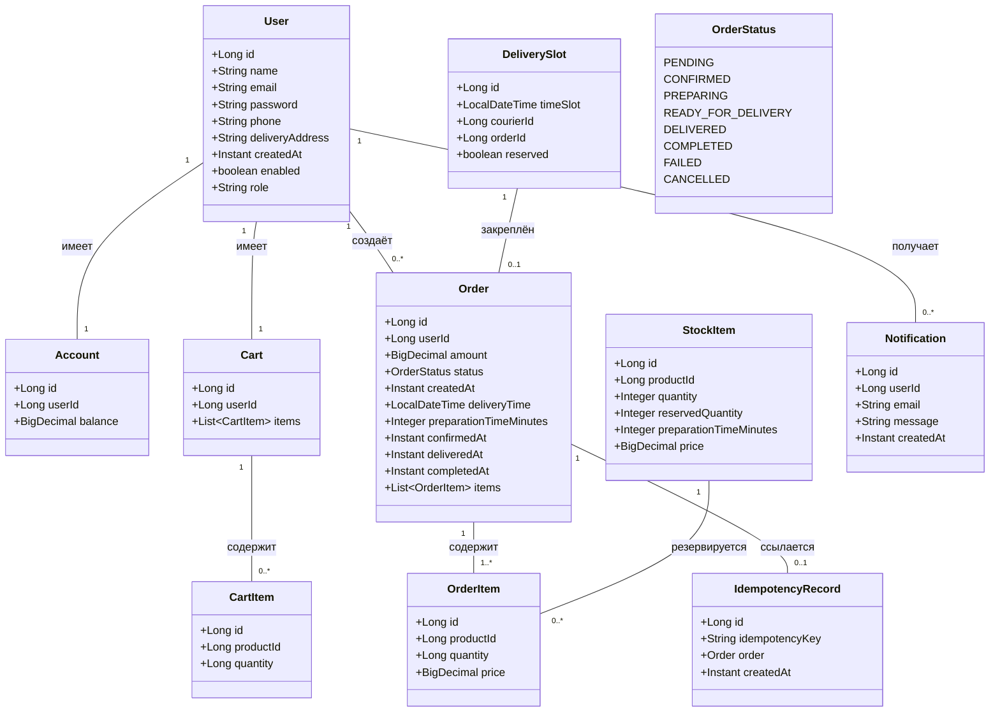

```mermaid
classDiagram
    class User {
        +Long id
        +String name
        +String email
        +String password
        +String phone
        +String deliveryAddress
        +Instant createdAt
        +boolean enabled
        +String role
    }

    class Account {
        +Long id
        +Long userId
        +BigDecimal balance
    }

    class Cart {
        +Long id
        +Long userId
        +List~CartItem~ items
    }

    class CartItem {
        +Long id
        +Long productId
        +Long quantity
    }

    class Order {
        +Long id
        +Long userId
        +BigDecimal amount
        +OrderStatus status
        +Instant createdAt
        +LocalDateTime deliveryTime
        +Integer preparationTimeMinutes
        +Instant confirmedAt
        +Instant deliveredAt
        +Instant completedAt
        +List~OrderItem~ items
    }

    class OrderItem {
        +Long id
        +Long productId
        +Long quantity
        +BigDecimal price
    }

    class IdempotencyRecord {
        +Long id
        +String idempotencyKey
        +Order order
        +Instant createdAt
    }

    class StockItem {
        +Long id
        +Long productId
        +Integer quantity
        +Integer reservedQuantity
        +Integer preparationTimeMinutes
        +BigDecimal price
    }

    class DeliverySlot {
        +Long id
        +LocalDateTime timeSlot
        +Long courierId
        +Long orderId
        +boolean reserved
    }

    class Notification {
        +Long id
        +Long userId
        +String email
        +String message
        +Instant createdAt
    }

    class OrderStatus {
        PENDING
        CONFIRMED
        PREPARING
        READY_FOR_DELIVERY
        DELIVERED
        COMPLETED
        FAILED
        CANCELLED
    }

    User "1" -- "1" Account : имеет
    User "1" -- "1" Cart : имеет
    User "1" -- "0..*" Order : создаёт
    Cart "1" -- "0..*" CartItem : содержит
    Order "1" -- "1..*" OrderItem : содержит
    Order "1" -- "0..1" IdempotencyRecord : ссылается
    StockItem "1" -- "0..*" OrderItem : резервируется
    DeliverySlot "1" -- "0..1" Order : закреплён
    User "1" -- "0..*" Notification : получает
```