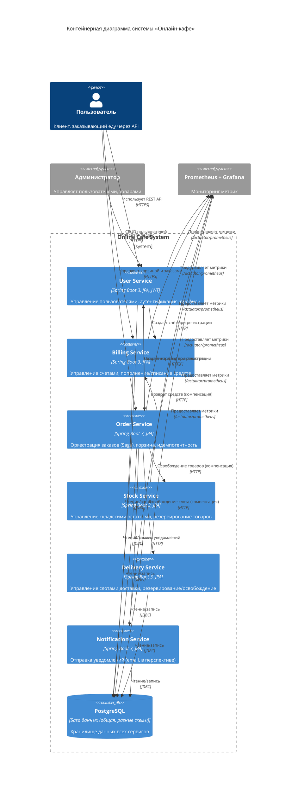

```mermaid
C4Context
    title Контейнерная диаграмма системы «Онлайн-кафе»

    Person(user, "Пользователь", "Клиент, заказывающий еду через API")
    System_Ext(admin, "Администратор", "Управляет пользователями, товарами")

    Boundary(system, "Online Cafe System") {
        Container(user_service, "User Service", "Spring Boot 3, JPA, JWT", "Управление пользователями, аутентификация, профили")
        Container(billing_service, "Billing Service", "Spring Boot 3, JPA", "Управление счетами, пополнение/списание средств")
        Container(order_service, "Order Service", "Spring Boot 3, JPA", "Оркестрация заказов (Saga), корзина, идемпотентность")
        Container(stock_service, "Stock Service", "Spring Boot 3, JPA", "Управление складскими остатками, резервирование товаров")
        Container(delivery_service, "Delivery Service", "Spring Boot 3, JPA", "Управление слотами доставки, резервирование/освобождение")
        Container(notification_service, "Notification Service", "Spring Boot 3, JPA", "Отправка уведомлений (email, в перспективе)")
        ContainerDb(db, "PostgreSQL", "База данных (общая, разные схемы)", "Хранилище данных всех сервисов")
    }

    System_Ext(monitoring, "Prometheus + Grafana", "Мониторинг метрик")

%% --- Чёрные стрелки (пользовательские сценарии) ---
Rel(user, user_service, "Использует REST API", "HTTPS")
Rel(user, order_service, "Управляет корзиной и заказами", "HTTPS")
Rel(user, billing_service, "Пополняет баланс", "HTTPS")
Rel(admin, user_service, "CRUD пользователей", "HTTPS")

%% --- Оранжевые стрелки (вызовы при регистрации) ---
Rel(user_service, billing_service, "Создаёт счёт при регистрации", "HTTP")
Rel(user_service, order_service, "Создаёт корзину при регистрации", "HTTP")

%% --- Синие стрелки (внутренние синхронные вызовы) ---
Rel(order_service, billing_service, "Списание/возврат средств", "HTTP")
Rel(order_service, stock_service, "Резервирование/освобождение/коммит товаров", "HTTP")
Rel(order_service, delivery_service, "Резервирование/освобождение слотов", "HTTP")
Rel(order_service, notification_service, "Отправка уведомлений", "HTTP")
Rel(order_service, user_service, "Получение email пользователя", "HTTP")

%% --- Синие стрелки к БД ---
Rel(user_service, db, "Чтение/запись", "JDBC")
Rel(billing_service, db, "Чтение/запись", "JDBC")
Rel(order_service, db, "Чтение/запись", "JDBC")
Rel(stock_service, db, "Чтение/запись", "JDBC")
Rel(delivery_service, db, "Чтение/запись", "JDBC")
Rel(notification_service, db, "Чтение/запись", "JDBC")

%% --- Синие стрелки к мониторингу ---
Rel(order_service, monitoring, "Предоставляет метрики", "/actuator/prometheus")
Rel(billing_service, monitoring, "Предоставляет метрики", "/actuator/prometheus")
Rel(delivery_service, monitoring, "Предоставляет метрики", "/actuator/prometheus")
Rel(stock_service, monitoring, "Предоставляет метрики", "/actuator/prometheus")
Rel(notification_service, monitoring, "Предоставляет метрики", "/actuator/prometheus")
Rel(user_service, monitoring, "Предоставляет метрики", "/actuator/prometheus")

%% --- Фиолетовые стрелки (компенсации Saga) ---
Rel(order_service, billing_service, "Возврат средств (компенсация)", "HTTP")
Rel(order_service, stock_service, "Освобождение товаров (компенсация)", "HTTP")
Rel(order_service, delivery_service, "Освобождение слота (компенсация)", "HTTP")

UpdateLayoutConfig($c4ShapeInRow="3", $c4BoundaryInRow="1")
```